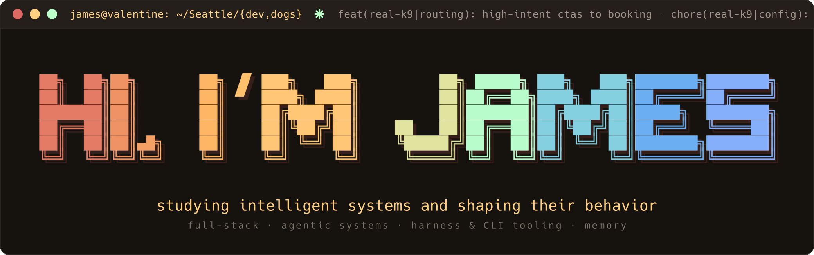

<!--
  Profile README. The terminal-window header below self-updates via GitHub Actions
  (.github/workflows/header.yml): the ✳ in the title bar is a live summary of recent
  commit activity across my repos. Sections below the header are scaffold — the selected
  work, latest writing, and statusline footer land in Track B.
-->

  

<!-- TODO (Track B): selected work · latest writing · statusline footer -->
